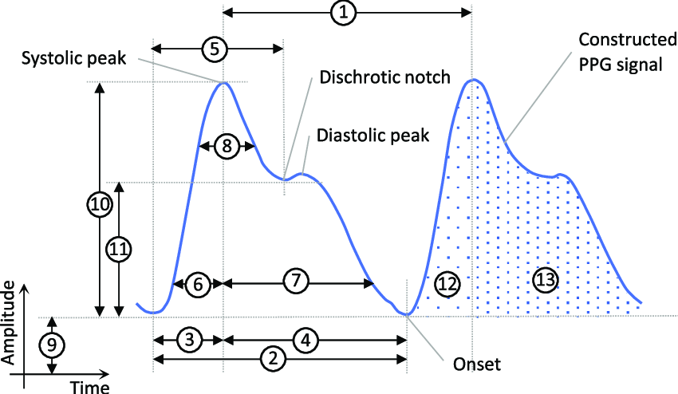
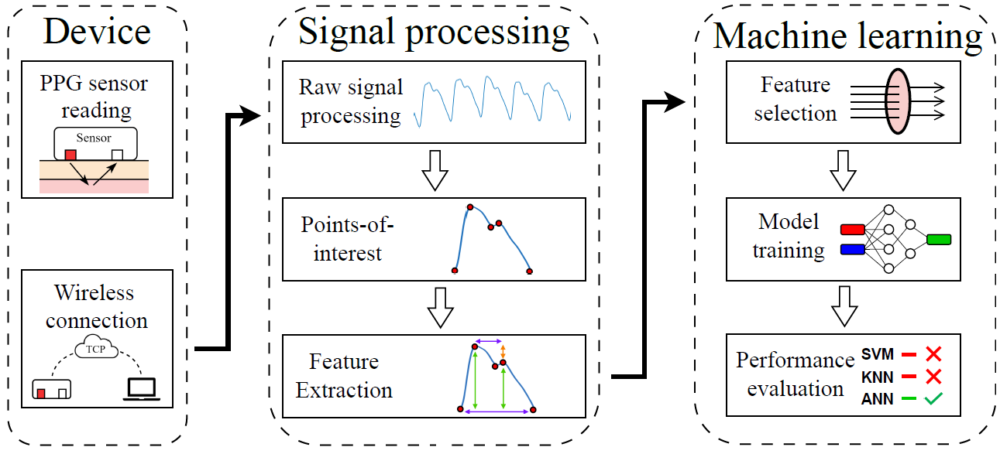
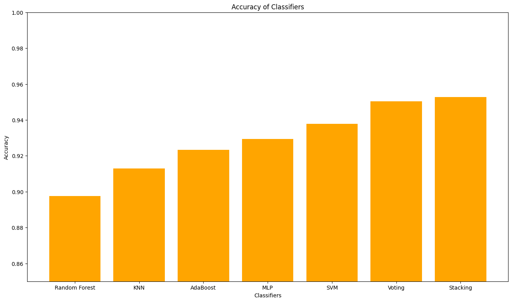
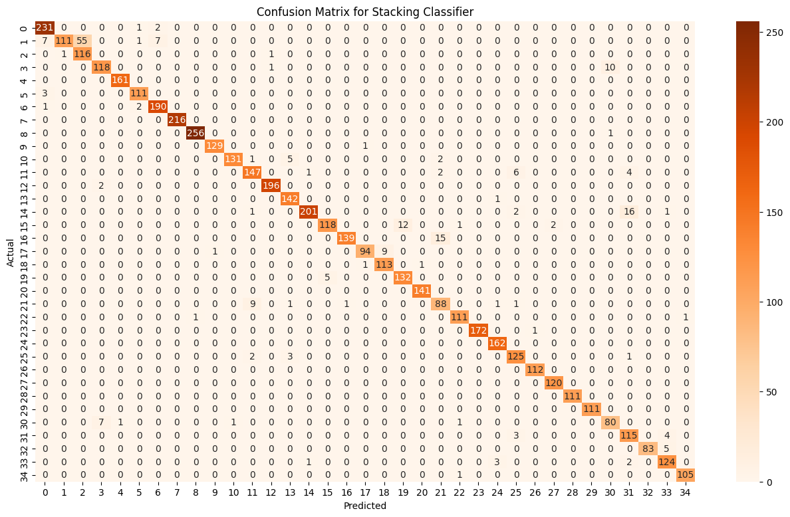
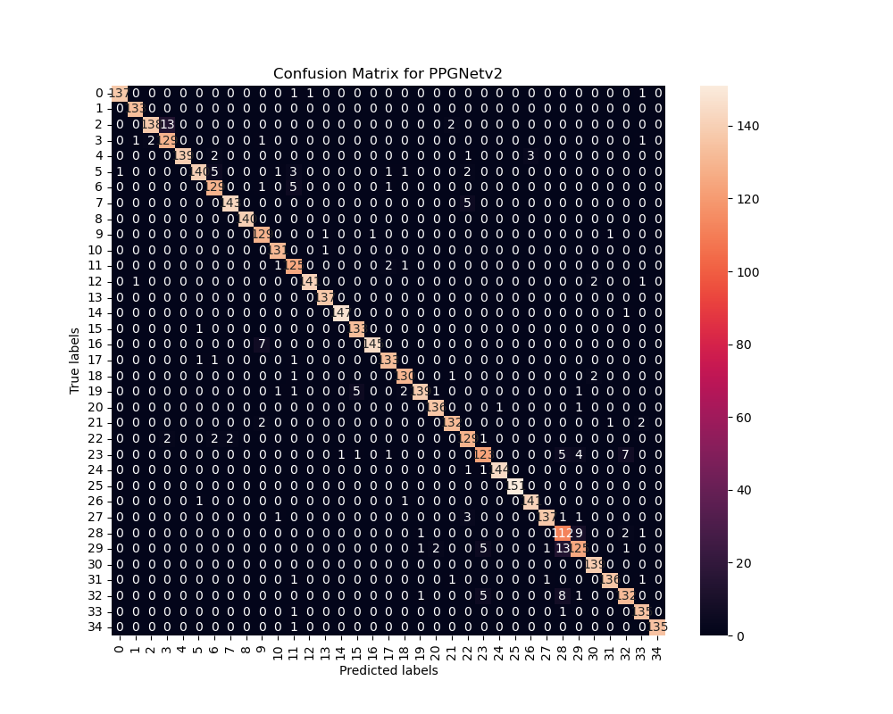

# Identification biométrique à l'aide de données PPG (Photopléthysmographie) et des techniques d'apprentissage machine

## Fichiers principaux
 - 1_supervised.ipynb: Contient toutes les expériences d'apprentissage supervisé (kNN, SVM, etc.)
 - nn.py: Contient le code pour l'entraînement et l'évaluation des réseaux de neurones à convolution

## Résumé
L'identification biométrique repose sur les caractéristiques physiques ou comportementales uniques d'un individu. La photopléthysmographie (PPG) est une méthode non invasive qui mesure les variations du volume sanguin dans les vaisseaux. Ce projet explore l'utilisation des techniques d'apprentissage machine pour l'identification biométrique à partir des données PPG. Les données sont collectées via des capteurs optiques, permettant d'extraire des caractéristiques distinctives pour chaque individu. Ces caractéristiques servent ensuite d'entrée pour les algorithmes d'apprentissage machine afin de créer un modèle de reconnaissance biométrique. Les résultats démontrent que les techniques d'apprentissage machine peuvent identifier avec succès les individus en utilisant les données PPG.

## 1. Introduction
Les systèmes biométrique identifient les individus à l'aide de traits physiologiques ou comportementaux uniques. Bien que les méthodes traditionnelles reposent sur les empreintes digitales ou la reconnaissance faciale, de nouvelles approches émergent pour exploiter les données physiologiques internes. La photoplythémographie (PPG) est une technique non invasive qui mesure les variations du volume sanguin dans les vaisseaux sanguins. Les capteurs optiques PPG sont couramment utilisés dans les montres intelligentes pour surveiller la fréquence cardiaque. Cependant, ces données peuvent également être utilisées pour l'identification biométrique. Ce projet présente l'utilisation des techniques d'apprentissage machine pour analyser les données PPG et les utiliser à des fins d'identification biométrique.

## 2. Contexte
### 2.1 Photopléthysmographie (PPG)
La photoplythémographie (PPG) est une technique qui mesure les variations du volume sanguin dans les vaisseaux sanguins. Les capteurs optiques PPG utilisent des LED pour éclairer la peau et des photodiodes pour mesurer la lumière réfléchie. Les variations de la lumière réfléchie sont dues aux changements de volume sanguin causés par le pouls cardiaque. Les signaux PPG sont souvent utilisés pour surveiller la fréquence cardiaque et d'autres paramètres physiologiques.

### 2.2 Apprentissage machine pour la biométrie
Les algorithmes d'apprentissage machine apprennent des motifs à partir de données étiquetées ou non étiquetées. Dans le cas de la biométrie, les données PPG peuvent être utilisées pour extraire des caractéristiques uniques de chaque individu. Ces caractéristiques peuvent être utilisées pour entraîner des modèles de reconnaissance biométrique. Les algorithmes d'apprentissage machine couramment utilisés pour la biométrie comprennent les réseaux de neurones, les machines à vecteurs de support et les forêts aléatoires.

## 3. Méthodologie
### 3.1 Acquisition des données
Les données PPG sont généralement collectées à l'aide d'appareils portable tels que des montres intelligentes ou des bracelets de fitness. Ces appareils utilisent des capteurs optiques pour mesurer la lumière réfléchie par la peau. Les signaux PPG sont ensuite échantillonnés et stockés pour l'analyse. Un ensemble de données standard inclut des enregistrements capturés dans des conditions contrôlées pour réduire le bruit et les artefacts.

### 3.2 Prétraitement des données
Les signaux PPG bruts sont souvent contaminés par des bruits dus à des artefacts de mouvement, la lumière ambiante ou les interferences de l'appareil utilisé. Le prétraitement des données est nécessaire pour nettoyer les signaux et extraire les caractéristiques pertinentes. Les étapes de prétraitement incluent:

-  **Filtrage du signal**: utilisation de filtres passe-bande pour isoler la plage de fréquences d'intérêt (par exemple, 0.5 - 4Hz pour les signaux cardiaques).
-  **Normalisation**: mise à l'échelle des signaux dans une plage uniforme pour garantir la cohérence.
-  **Segmentation**: découpage des signaux en fenêtres temporelles pour l'analyse et l'extraction de caractéristiques.

### 3.3 Extraction des caractéristiques
Les caractéristiques principales extraites des signaux PPG comprennent:
-  **Caractéristiques temporelles**: moyenne, variance, skewness, kurtosis, etc.
-  **Caractéristiques fréquentielles**: fréquence cardiaque, puissance spectrale, etc.
-  **Caractéristiques morphologiques**: largeur de l'onde, amplitude, etc.

*Example de caractéristiques pouvant être extraites d'un échantillon PPG*

> https://www.researchgate.net/publication/361819163/figure/fig3/AS:1175230038966272@1657208084033/Commonly-extracted-features-from-the-PPG-signal-for-BP-estimation-The-figure-displays-a.png

1. Peak to peak interval
2. Pulse interval
3. Systolic upstroke time
4. Diastolic time
5. Distrotic notch time
6. Systolic width at x%
7. Diastrolic width at x%
8. Systolic width at y%
9. Valley amplitude
10. Systolic peak amplitude
11. Discrotic notch amplitude 
12. Systolic area
13. Diastolic area

### 3.4 Apprentissage machine
#### 3.4.1 Appentrissage supervisé
Différents algorithmes d'apprentissage supervisé peuvent être utilisés pour la classification:

- **Machine à vecteurs de support (SVM)**: efficaces pour les données de haute dimension avec des noyaux permettant de séparer les classes.
- **Forêts aléatoires**: une approche basée sur des ensembles construisant des arbres de décision pour une classification robuste.
- **k-plus proches voisins (k-NN)**: Une méthode simple pour les petits ensembles de données.
- **Perceptron multicouche (MLP)**: capturent des motifs complexes dans les données PPG via des transformations non linéaires multiples.
- **Ensembles de modèles**: combinaison de plusieurs modèles pour améliorer la précision de la classification.

#### 3.4.2 Réseau de neurones à convolution
Il est aussi possible de sauter l'étape d'extraction de caractéristiques en utilisant un réseau de neurones approprié. Ce réseau doit être capable, dans un premier temps, d'apprendre une représentation efficace du signal PPG, et, dans un deuxième temps, d'utiliser celle-ci pour associer un utilisateur à un segment de signal. Plusieurs architectures ont été testées; la plus efficace est présentée ci-bas. Elle est constituée de 7 couches de neurones à convolution, auxquelles sont ensuite enchaînées 3 couches pleinements connectées et finalement la couche de sortie. Toutes les couches de neurones sont normalisées; leurs fonctions d'activation est la fonction ReLU.

## 4. Résultats expérimentaux
### 4.1 Ensemble de données
L'ensemble de données utilisé pour l'expérimentation comprend des signaux PPG collectés auprès de 35 participants. Chaque participant a fourni des enregistrements de PPG dans des conditions contrôlées. Les signaux correspondent à un enregistrement de 6 secondes à une fréquence de 50 Hz, donc à 300 points de données par échantillon.

- Résumé des résultats pour les modèles d'apprentissage supervisé

- Matrice de confusion du meilleur modèle supervisé (stacking)

La méthode employant un réseau de neurones à convolution produit des résultats similaires aux autres modèles, et a une précision de 93.91%. Le réseau prend quelques minutes à être entraîné, dépendemment des ressources disponibles.

- Matrice de confusion du meilleur réseau de neurones à convolution

### 4.2 Résultats

Les résultats expérimentaux montrent que les caractéristiques extraites des signaux PPG peuvent être utilisées pour identifier de manière fiable les individus. Les algorithmes d'apprentissage machine supervisés ont obtenu une précision de classification de 95% en moyenne. Les caractéristiques temporelles et fréquentielles se sont révélées être les plus discriminantes pour l'identification biométrique. Il a aussi été montré qu'il est possible d'apprendre les caractéristiques via un réseau de neurones à convolution plutôt que de les extraires manuellement. Les résultats suggèrent que les données PPG peuvent être une source prometteuse pour les systèmes biométriques futurs.

## 5. Limitations et défis
Malgré les résultats prometteurs, plusieurs limitations et défis doivent être abordés:

-  **Sensibilité au bruit**: Les signaux PPG sont sensibles aux artefacts de mouvement, à la lumière ambiante et aux interférences de l'appareil, réduisant la précision dans des environnement qui ne sont pas contrôlés. Des techniques de prétraitement avancées sont nécessaires pour nettoyer les signaux.
-  **Variabilité interindividuelle**: Les caractéristiques physiologiques peuvent varier considérablement d'un individu à l'autre, nécessitant des modèles robustes pour la généralisation. Les facteurs comme le stress, la température ou l'état physique d'un individu influencent les signaux PPG ce qui complique l'identification.
-  **Scalabilité**: La précision peut diminuer avec un nombre élevé d'individus dans la base de données. Les algorithmes d'apprentissage machine doivent être conçus pour gérer efficacement de grandes quantités de données.
-  **Dépendance technologique**: Les dispositifs portables actuels varient en qualité, ce qui affecte la reproduction des résultats. Des études supplémentaires sont nécessaires pour évaluer la robustesse des modèles sur différentes plateformes.

## 6. Conclusion
Ce projet montre que les techniques d'apprentissage machine permettent d'exploiter efficacement les données PPG pour l'identification biométrique. En combinant un prétraitement robuste, une extraction de caractéristiques et des algorithmes de classification avancés, des niveaux élevés de précision sont atteints. Les résultats suggèrent que les données PPG peuvent être une source prometteuse pour les systèmes biométriques futurs. Cependant, des recherches supplémentaires sont nécessaires pour aborder les limitations et défis actuels.
